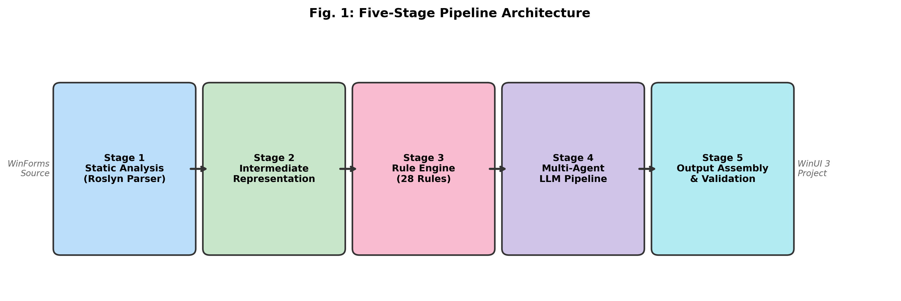
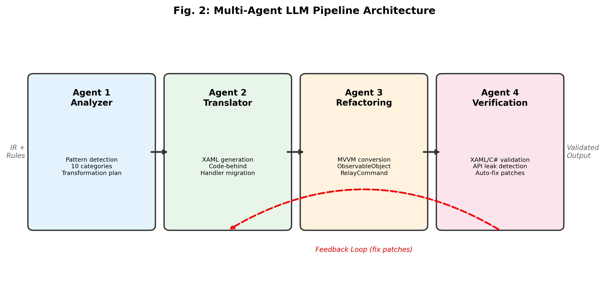
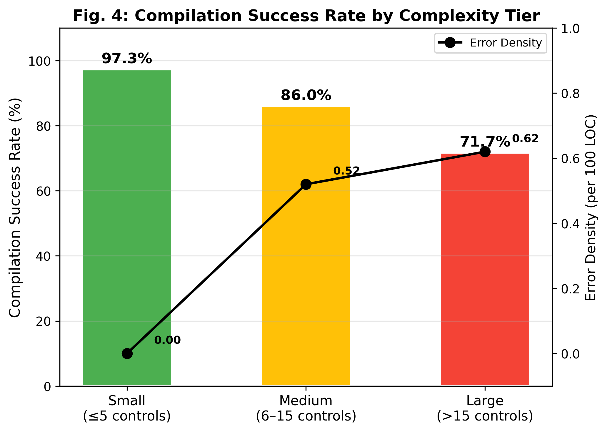

# Automated Migration of Legacy Windows Desktop Applications to WinUI 3

A hybrid framework combining **deterministic rule-based transformations** with a **multi-agent LLM architecture** to automatically migrate legacy Windows Forms (WinForms) applications to modern WinUI 3 projects.



## Key Results

| Approach | Compilation Success Rate | Migration Completeness | UI Parity | Time Reduction | Error Density |
|----------|:---:|:---:|:---:|:---:|:---:|
| Rule-Only | 63.2% | 88.2% | 90.7% | 2,640x | 3.49 |
| Single-Agent LLM | 76.2% | 97.0% | 96.5% | 4,107x | 1.15 |
| **Full Hybrid (Ours)** | **87.1%** | **97.0%** | **100.0%** | **5,867x** | **0.33** |

Evaluated on 12 synthetic WinForms applications (165 controls, 62 event handlers) across three complexity tiers.

## Framework Architecture

The migration process follows a **five-stage pipeline**:

1. **Static Analysis** -- Roslyn-based extraction of UI control hierarchies, event bindings, and layout structures from `.Designer.cs` and `.cs` files
2. **Intermediate Representation** -- Framework-independent JSON model decoupling source semantics from syntax
3. **Rule-Based Transformation** -- 30 deterministic control/property mapping rules (e.g., `Button.Text` -> `Button.Content`)
4. **Multi-Agent LLM Pipeline** -- Four specialized agents:
   - **Analyzer Agent**: Identifies complex patterns and generates transformation plans
   - **Translator Agent**: Generates WinUI 3 XAML and code-behind
   - **Refactoring Agent**: Converts event-driven code to MVVM (ObservableObject, RelayCommand)
   - **Verification Agent**: Validates output and feeds back corrections
5. **Output Assembly** -- Generates complete `.csproj`, XAML, code-behind, and ViewModel files



## Repository Structure

```
.
├── framework/                  # Core migration framework
│   ├── parser.py               # Roslyn-based WinForms parser
│   ├── ir.py                   # Intermediate representation
│   ├── rules.py                # Rule-based transformation engine (30 rules)
│   ├── pipeline.py             # End-to-end migration pipeline
│   ├── metrics.py              # Evaluation metrics (CSR, MC, UPS, TRR, ED)
│   ├── demo.py                 # Live demonstration script
│   ├── run_experiments.py      # Experiment runner (3 baselines x 12 apps)
│   ├── generate_test_apps.py   # Synthetic test app generator
│   ├── agents/                 # LLM agent implementations
│   │   ├── analyzer.py         # Pattern analysis agent
│   │   ├── translator.py       # XAML generation agent
│   │   ├── refactoring.py      # MVVM conversion agent
│   │   └── verification.py     # Compilation verification agent
│   ├── test_apps/              # 12 synthetic WinForms test applications
│   │   ├── small_01_calculator/
│   │   ├── small_02_login/
│   │   ├── ...
│   │   └── large_03_dashboard/
│   └── experiments/            # Experiment results and generated outputs
│       ├── experiment_results.csv
│       ├── experiment_results.txt
│       ├── hybrid/             # Generated WinUI 3 output (hybrid approach)
│       ├── rule_only/          # Generated output (rule-only baseline)
│       └── single_agent/       # Generated output (single-agent baseline)
├── dataset/                    # GitHub dataset collection
│   ├── collect_dataset.py      # GitHub API dataset collector
│   ├── collect_dataset_large.py # Expanded collector (530 repos)
│   ├── dataset.csv             # 530 repositories metadata
│   └── dataset_stats.md        # Dataset statistics summary
├── paper/                      # Research paper
│   ├── PAPER_DRAFT.md          # Full paper (Markdown)
│   └── paper_ieee.tex          # IEEE conference format (LaTeX)
├── figures/                    # Paper figures (300 DPI)
│   ├── architecture.png        # Five-stage pipeline diagram
│   ├── agents.png              # Multi-agent workflow diagram
│   ├── baseline_chart.png      # Baseline comparison chart
│   └── tier_chart.png          # Per-tier results chart
├── generate_figures.py         # Script to regenerate all figures
└── requirements.txt            # Python dependencies
```

## Quick Start

### Prerequisites

- Python 3.10+
- pip

### Installation

```bash
git clone https://github.com/floatingbrij/legacy-desktop-migration-llm.git
cd legacy-desktop-migration-llm
pip install -r requirements.txt
```

### Run Demo

```bash
cd framework
python demo.py
```

This runs all 5 pipeline stages on a sample calculator app, showing:
- Parser extracting 18 controls and 4 event handlers
- IR generation
- 30 rule-based transformations
- 4-agent LLM pipeline (Analyzer -> Translator -> Refactoring -> Verification)
- Generated output: XAML + code-behind + ViewModel

### Run Full Experiments

```bash
cd framework
python demo.py --full
```

Runs all 12 test apps across 3 baselines (rule-only, single-agent, hybrid) and prints the results table.

### Run Notebook (Recommended)

Open `framework/migration_pipeline_notebook.ipynb` in Jupyter or Google Colab for an interactive walkthrough of the full pipeline with visualizations.

### Regenerate Figures

```bash
python generate_figures.py
```

## Dataset

530 open-source Windows desktop repositories collected from GitHub:
- 300 WinForms, 150 WPF, 80 UWP
- Average 1,167 stars per repository
- 10,303 `.Designer.cs` files, 23,004 `.xaml` files, 210,266 `.cs` files

See [`dataset/dataset.csv`](dataset/dataset.csv) for the full list.

## Evaluation Metrics

| Metric | Description |
|--------|-------------|
| **Compilation Success Rate (CSR)** | % of generated projects that compile without errors |
| **Migration Completeness (MC)** | % of source UI elements successfully represented in output |
| **UI Parity Score (UPS)** | Structural similarity between original and migrated UI hierarchy |
| **Time Reduction Ratio (TRR)** | Ratio of estimated manual effort to automated migration time |
| **Error Density (ED)** | Compilation errors per 100 lines of generated code |

## Results by Complexity Tier



| Tier | Apps | CSR | MC | UPS | ED |
|------|:---:|:---:|:---:|:---:|:---:|
| Small (<=5 controls) | 5 | 97.3% | 96.0% | 100% | 0.00 |
| Medium (6-15 controls) | 4 | 86.0% | 100% | 100% | 0.52 |
| Large (>15 controls) | 3 | 71.7% | 94.7% | 100% | 0.62 |

## Citation

If you use this work, please cite:

```bibtex
@article{brijesharun2026winui3migration,
  title={Automated Migration of Legacy Windows Desktop Applications to WinUI 3 Using Hybrid Rule-Based and Multi-Agent LLM Framework},
  author={Brijesharun, G and Hariprasad, S},
  year={2026}
}
```

## License

This project is licensed under the MIT License - see the [LICENSE](LICENSE) file for details.

## Author

**Brijesharun G**  
PG Scholar, Dept. of Data Science and Business Systems  
SRM Institute of Science and Technology, Kattankulathur, India  
brijesharun@gmail.com
